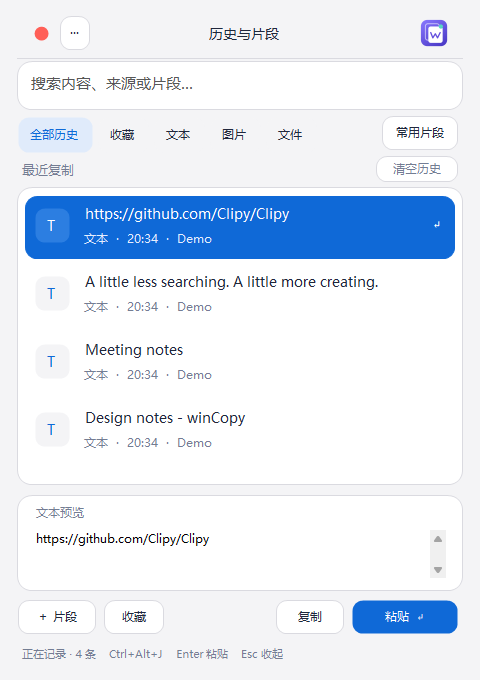
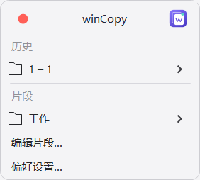
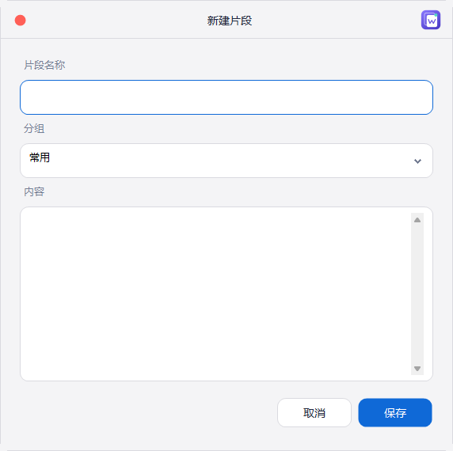
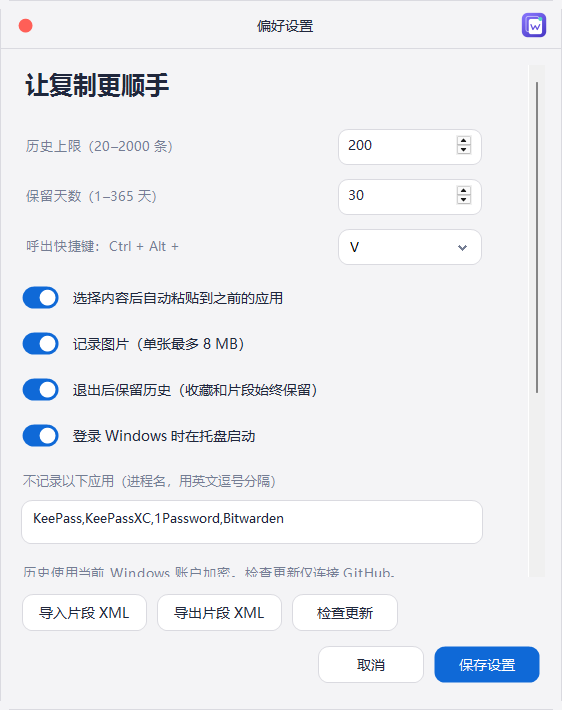

# winCopy

[](https://github.com/Alexei-xie/winCopy/actions/workflows/build.yml)
[](LICENSE)

适用于 Windows 10 / 11 的轻量原生剪贴板管理器。以 [Clipy](https://github.com/Clipy/Clipy) 的历史、片段与快捷键工作流为参考，独立 C# / Windows Forms 实现，不包含 Clipy 的 Swift 代码或图标。



界面采用 mac 风格浅灰圆角窗口、蓝色选中状态、自绘标题栏和统一的应用标志，详见 [设计说明](docs/DESIGN.md)。

## 下载与安装

前往 [Releases](https://github.com/Alexei-xie/winCopy/releases/latest)：

- `winCopy-版本-setup.exe`：当前用户安装，无需管理员权限，包含开始菜单入口与卸载程序。
- `winCopy-版本-portable.zip`：解压运行 `winCopy.exe`。
- `SHA256SUMS.txt`：安装包与便携包校验值。

使用 Windows 自带的 .NET Framework 4.x，不需要 Node.js 或浏览器运行时。安装包未进行代码签名，Windows 可能显示未知发布者提示。升级前请右键系统托盘图标退出旧版。卸载保留 `%LOCALAPPDATA%\winCopy` 中的数据。

## 功能

- 文本、HTML/RTF、图片、文件路径历史，支持去重、搜索、分类、收藏和预览。
- 无标题栏圆角弹窗；顶部可拖动，记住位置；按 Esc 或切换应用后收起。
- 常用文本片段、横向分组标签、拖拽排序，超出宽度时滚轮或箭头浏览。
- Clipy 风格片段 XML 导入/导出（folders/folder/title/snippets/snippet/title/content）。
- 托盘暂停记录，历史上限和保留天数，进程排除，快捷键设置及登录启动。
- Windows DPAPI 当前用户加密与原子保存。剪贴板数据仅保存在本地，无遥测或云同步；手动检查更新时会连接 GitHub。

## Clipy 风格快捷菜单



拖动快捷菜单顶部标题或 logo 区域即可移动，位置会保存并在下次呼出时恢复。左上红色按钮关闭当前菜单。历史管理、设置、添加/编辑片段、检查更新和确认提示均采用相同的圆角标题栏，支持拖动和右上角 logo；编辑窗口的关闭/取消不会保存修改。系统文件和目录选择器保留 Windows 原生交互。





按 Ctrl + Alt + V 或单击/右键托盘图标，在鼠标附近打开圆角级联菜单。历史按每 10 条分页；片段按已有分组排序，鼠标悬停展开子菜单。单击条目按偏好设置自动粘贴（关闭自动粘贴时仅复制）。方向键逐级导航，Enter 选择，Esc 返回/收起；屏幕边缘由菜单系统调整展开方向，过长菜单可滚动。

底部提供清除历史、编辑片段、管理历史 / 搜索、偏好设置、暂停记录、检查更新和退出。「编辑片段」进入现有片段管理窗口，可新建、编辑、删除和排序；「管理历史 / 搜索」保留原有搜索、预览、收藏和拖动窗口功能。清除历史仍需确认，保留收藏与片段。

## 片段分组

应用使用原创叠纸 W 标志，桌面程序、托盘、安装包与片段窗口统一使用多尺寸图标。

新建和编辑片段时，「分组」使用应用内自绘圆角下拉面板：点击输入区域、边框或箭头均可展开，支持输入筛选、滚轮浏览、方向键及 Enter 选择、Esc 收起。支持下拉选择已有分组（按当前排序显示），也可以手动输入新名称。新名称在保存片段后才成为分组；取消编辑不会创建空分组。删除或移走某组最后一个片段后，该组自动从标签、下拉列表和排序记录中移除。

## 自定义存储位置与清空历史

在偏好设置中向下滚动到「存储位置」，点击「更改存储目录…」选择目录，再点击「保存设置」。程序写入并校验新目录的数据后才切换，历史、收藏、片段及设置会一同迁移。目标目录不能已有 `history.dat`，不会覆盖已有数据。关闭历史持久化时，迁移遵循同样规则，仅持久化收藏和片段。

路径指针保存在默认目录 `%LOCALAPPDATA%\winCopy\storage-location.txt`；历史数据位于所选目录的 `history.dat`。不要删除路径指针。原目录保留恢复副本，不会被继续更新；确认迁移成功后可自行备份或删除旧数据。失败时仍使用原目录，目标目录可能留有迁移副本，应检查后选择空目录重试。自定义磁盘离线或数据缺失时会提示错误并禁止覆盖，不会静默创建空历史。数据仍仅能由当前 Windows 账户解密。

主面板列表上方有「清空历史」按钮，确认后清除全部未收藏的普通历史，并立即保存。收藏、片段及系统剪贴板不受影响；保存失败则保留原历史。清空操作仅作用于当前数据文件，不会清除迁移前留下的恢复副本。

## 检查更新

在主面板右上角更多菜单、托盘右键菜单或偏好设置中点击「检查更新」。后台查询 GitHub 最新正式版，显示当前版本和更新说明；有新版时可打开官方安装包下载。不会自动安装或重启，下载完成后请先从托盘退出旧版再安装。离线、超时或限流时可重试，也可直接打开发布页。仅发送公开版本查询请求和应用版本，不读取或上传剪贴板数据。

## 快捷键

| 操作 | 快捷键 |
| --- | --- |
| 呼出快捷菜单 | Ctrl + Alt + V（可设置） |
| 搜索 | Ctrl + F |
| 选择列表 | 搜索框内按 ↓ |
| 粘贴选中内容 | Enter / 双击 |
| 只复制 | Ctrl + Enter |
| 纯文本粘贴 | Shift + Enter |
| 收起 | Esc |

点击右上角更多菜单可打开设置、新建片段、暂停记录或退出。右键历史项可编辑、收藏及删除。关闭面板不会退出托盘程序。

## 数据与限制

- 默认数据文件：`%LOCALAPPDATA%\winCopy\history.dat`（可在设置中迁移），仅当前 Windows 账户可解密。
- 默认 200 条历史、30 天；设置范围为 20–2000 条、1–365 天，输入或粘贴超大数字会立即限制至上限；收藏与片段不自动过期。单张图片上限 8 MB / 2500 万像素；普通历史负载约 64 MB 后淘汰较老内容。
- 关闭历史持久化后，普通历史仅在本次会话保留；收藏和片段仍会保存。
- 文件历史保存路径，不备份原文件；不支持剪贴板中的全部自定义二进制格式。
- 默认排除 KeePass、KeePassXC、1Password、Bitwarden；依据读取时的前台进程识别。尊重部分剪贴板排除标记，不能保证识别全部密码内容。
- 自动粘贴受到 Windows 前台窗口与权限限制。失败时内容保留在剪贴板，可手动 Ctrl+V。
- XML 导出是明文，仅包含片段。取消设置不撤销已经执行的片段导入/导出。
- Windows 10/11 真机、多屏及真实高 DPI 环境仍需持续验收。自动化缩放测试不等同于真实 DPI 验证。

## 从源码构建

Windows PowerShell：

```powershell
.\build.ps1
Start-Process .\dist\winCopy.exe -ArgumentList '--self-test' -Wait
Get-Content .\dist\self-test-result.txt
```

构建使用 Windows 自带 C# 编译器，无需还原第三方 NuGet 包。也可用 Visual Studio 打开 `winCopy.csproj`，需安装 .NET Framework 4.8 开发工具。

构建安装包需要 [Inno Setup 6](https://jrsoftware.org/isinfo.php)：

```powershell
.\package.ps1
# 或指定编译器路径
.\package.ps1 -IsccPath 'C:\Program Files (x86)\Inno Setup 6\ISCC.exe'
```

产物在 `artifacts/`。`tests/` 包含桌面交互与布局测试，需单独编译并引用构建后的 `winCopy.exe`。其中 `Integration.cs` 会临时操作剪贴板，测试后尝试恢复；不用于无交互 CI。`verify.ps1` 可生成使用示例数据的窗口截图。

## GitHub Actions 与发布

[构建流程](.github/workflows/build.yml) 在推送 `main`、提交 PR 或手动运行时，编译程序、运行存储自测、生成安装包/便携包/校验文件，并执行静默安装和卸载检查。通过后产物上传至 Actions Artifacts，保留 30 天。

发布版本：同步修改 `VERSION` 与 `AssemblyInfo.cs` 中的版本号，提交后推送对应标签：

```powershell
git tag v1.0.0
git push origin v1.0.0
```

标签必须与 `VERSION` 对应。成功构建后自动创建 GitHub Release 并上传三个发布文件；重跑会更新同版本附件。发布权限仅授予 release job。

## 开源许可

[MIT License](LICENSE)，Copyright (c) 2026 Alexei-xie。欢迎提交 Issue 和 Pull Request。
